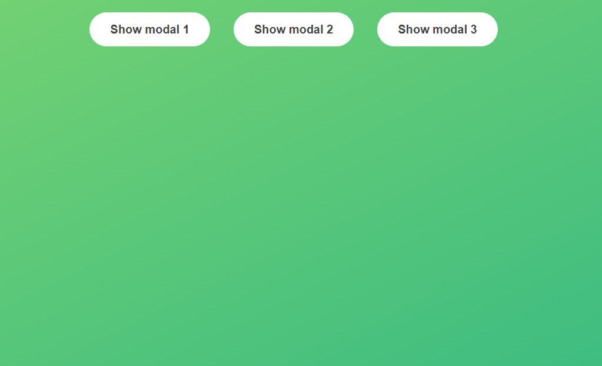
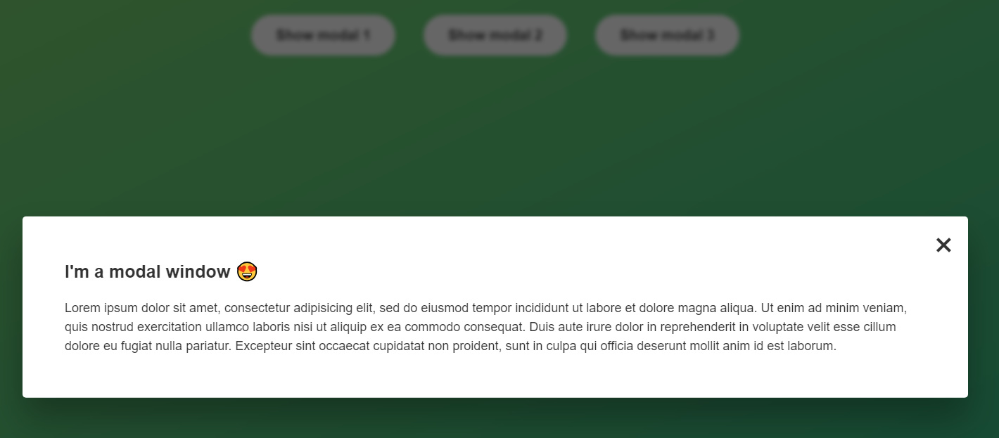

# PROJECT-Modal-Window

This repository contains a simple example of a modal popup in a web page. It uses HTML, CSS, and JavaScript to create a modal that can be opened and closed by clicking buttons and overlay, as well as by pressing the 'Escape' key.

##Features
Open and close the modal by clicking buttons.
Close the modal by clicking the overlay.
Close the modal by pressing the 'Escape' key on your keyboard.
Usage
You can use this example to learn how to create and implement a modal popup in your web projects. The provided code is well-commented and easy to follow.

To get started, follow these steps:

Clone the repository to your local machine.
Open the index.html file in your web browser to see the modal in action.
Explore the code in the script.js file to understand how the modal functionality works.
Feel free to modify and customize the code to suit your own projects.
Demo
You can see a live demo of the modal in action here.

##Contributing
If you'd like to contribute to this project, please open an issue or create a pull request with your improvements. Your contributions are welcome!

##Acknowledgments
This example was created based on a tutorial or code snippet. The Complete JavaScript Course 2023: From Zero to Expert! by Jonas Schmedtman
